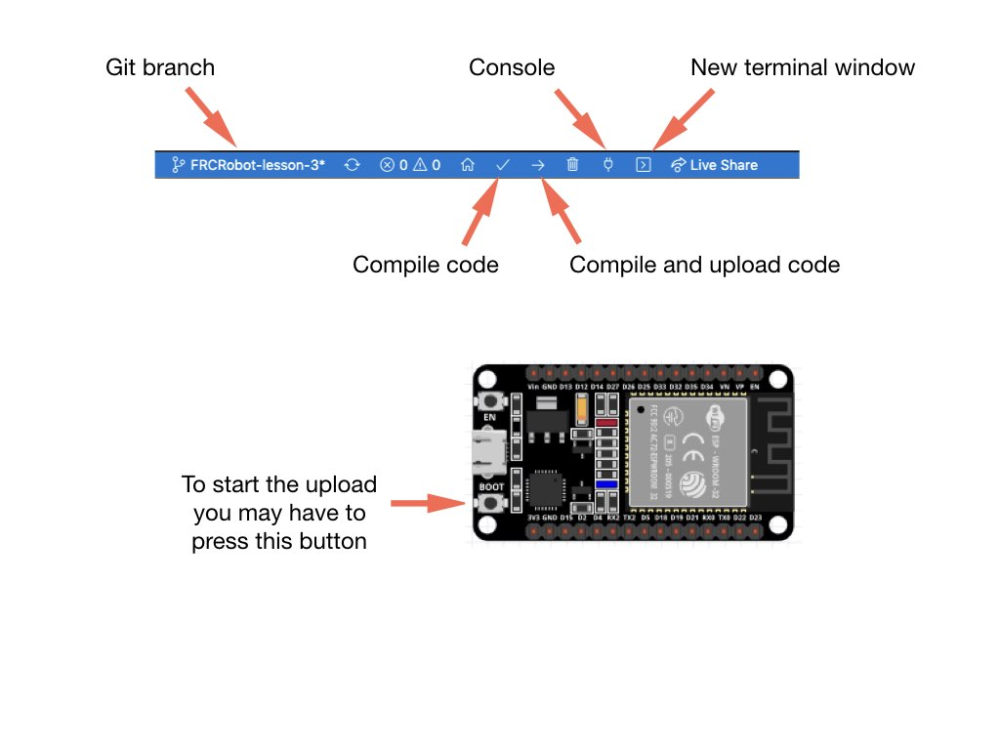

# Development Environment Setup
The code must be run on an ESP32 NodeMCU development board, which is an embedded Arduino based microcontroller with built-in WiFi.  For the development environment (IDE) we'll be using VSCode.  This is the IDE most commonly used by <i>First Robotics</i> teams.  In order to install code onto the ESP32 microcontoller you have to install the PlatformIO plugin for VSCode. Information about the PlatformIO plugin can be found here:

[Getting Started with PlatformIO](https://dronebotworkshop.com/platformio/)

[How To Install PlatformIO ](https://www.youtube.com/watch?v=5edPOlQQKmo)

Once you have the PlatformIO plugin installed the FRCRobot code can be cloned from Github following these instructions:
- From VSCode go to `View->Command Palette`.
- Type in `git clone` ,which will bring up a text box.
- Put in https://github.com/mjwhite8119/FRCRobot.git and press enter.
- You'll then be prompted to enter a directory location on your local machine in which to store the project.  Call it <i>FRCRobot</i>.
- Finally, click the button to open the project in VSCode.

## Connecting the Robot to your WiFi
Follow these steps to connect the robot to your home WiFi:

1. Create a file under the `include` directory called `wifiConfig.h`.
2. Paste the following two lines into the file.

        inline const char* ssid = "SSID";
        inline const char* password = "PASSWORD";

3. Add your WiFi SSID and password in place of SSID and PASSWORD.

## Compile and Upload Code to the ESP32
Connect a UBS cable from your computer to the ESP32.  Click the upload `->` link in the status bar at the bottom of VSCode to compile and upload. If the upload fails to start you may have to press the <i>BOOT</i> button on the ESP32 microcontroller until the upload starts.

After the upload completes your WiFi router will assign the robot an IP address which will be displayed on the OLED display.  You will need this address to open the web page used as the controller. 

You're all done! 

<h3>
<a href="trainingRobot">Previous</a>

<a href="bom">Next</a></h3>