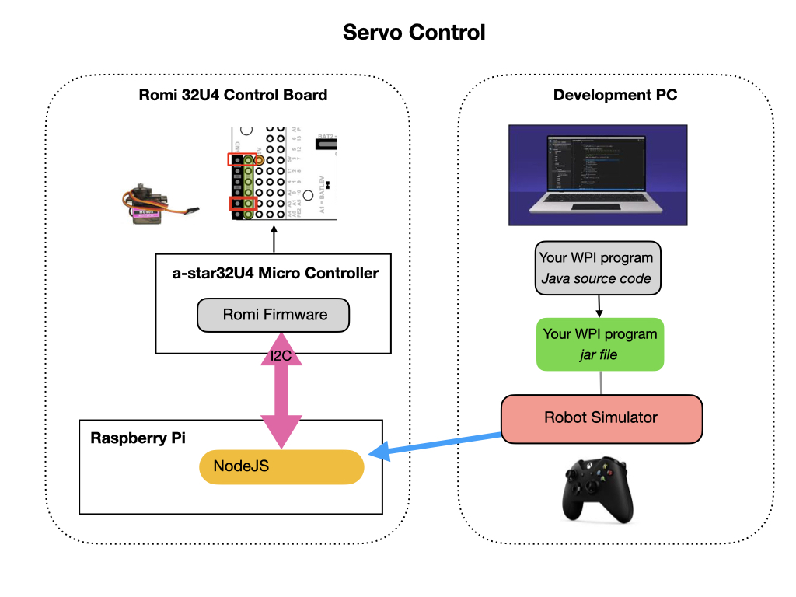

# Romi Robot Arm
Before reading this section please review the [SimpleArm documentation](https://github.com/bb-frc-workshops/romi-examples/tree/main/simpleArm) on the BB FRC Workshops site.

## Additional details
This is how the software stack works together to operate the robot arm.

Every time a button is pressed the related arm piece is moved incrementally.  There are min and max limits to the range of motion of the arm.  The range of the servo is 0 to 180 degrees but that is too large a range for the arm.

Make sure that the power to the arm servos is disconnected when you switch on the Romi.  Otherwise, the firmware will activate the servos to there full position which is outside of the recommended range.  

Start your java program and put it into teleop mode.  Move the Tilt and Lift buttons, and then connect the power to the servos.  
Prior to ending your program switch off the power to the servos.

<h3>
<a href="romiCode7">Previous</a>

<a href="colorSensor">Next</a></h3>