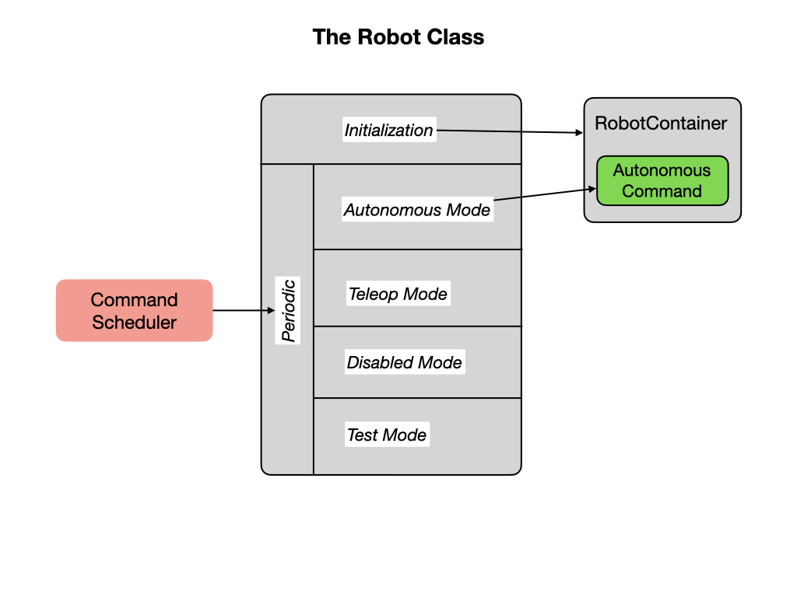

# Basic Robot Structure
There are four basic components that you'll need to create a program for an FRC robot.  The code for each component is in a separate file.  

## The Main Class
The Main.java file is the starting point for the entire program and calls the Robot class to start building the robot.  You should never need to change this file.

## Robot Class
The Robot.java file defines the Robot class 

## RobotContainer Class

The **setDefaultCommand( )** method sets the default Command of the subsystem. The default command will be automatically scheduled when no other commands are scheduled that require the subsystem. Default commands should generally not end on their own, i.e. their Command **isFinished()** method should always return false. Will automatically register this subsystem with the CommandScheduler

## The Constants File

This file provides a central location for defining constants.  Constants are values assigned to variables that do not change throughout the execution of the program.

Rename the class `RomiDriveTrain` to just `DriveTrain`.  After renaming VSCode will prompt you to refactor.  This will find all references to the `RomiDriveTrain` and change them to `DriveTrain`.

<h3>
<a href="romiExampleCode">Previous</a>

<a href="romiCode2">Next</a></h3>
