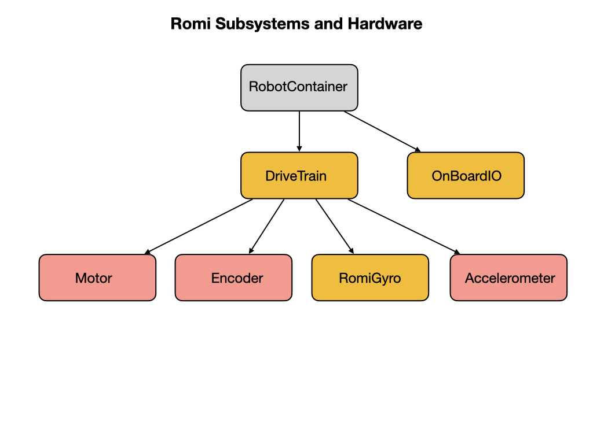

# Subsystems
Subsystems are the basic unit of robot organization in the Command-based framework.  They encapsulate low-level hardware objects (motor controllers, sensors, etc) and provide methods that can be used by Commands.  Hardware resources used within a subsystem should generally remain encapsulated and not be shared by other parts of the robot.

## Lab - DriveTrain Subsystem
Explain the DriveTrain class and 

## Lab - Gyro Subsystem
add in the Gyro class.

## The periodic( ) method
This method is called periodically by the CommandScheduler. Useful for updating subsystem-specific state that you don't want to offload to a Command. Teams should try to be consistent within their own codebases about which responsibilities will be handled by Commands, and which will be handled here.

## The register( ) method 
 Subsystems must be registered with the scheduler with the CommandScheduler's **registerSubsystem( )** method in order for the Subsystem **periodic()** method to be called. It is recommended that this method be called from the constructor of users' Subsystem implementations. The SubsystemBase class offers a simple base for user implementations that handles this.

<h3>
<a href="romiCode1">Previous</a>

<a href="romiCode3">Next</a></h3>