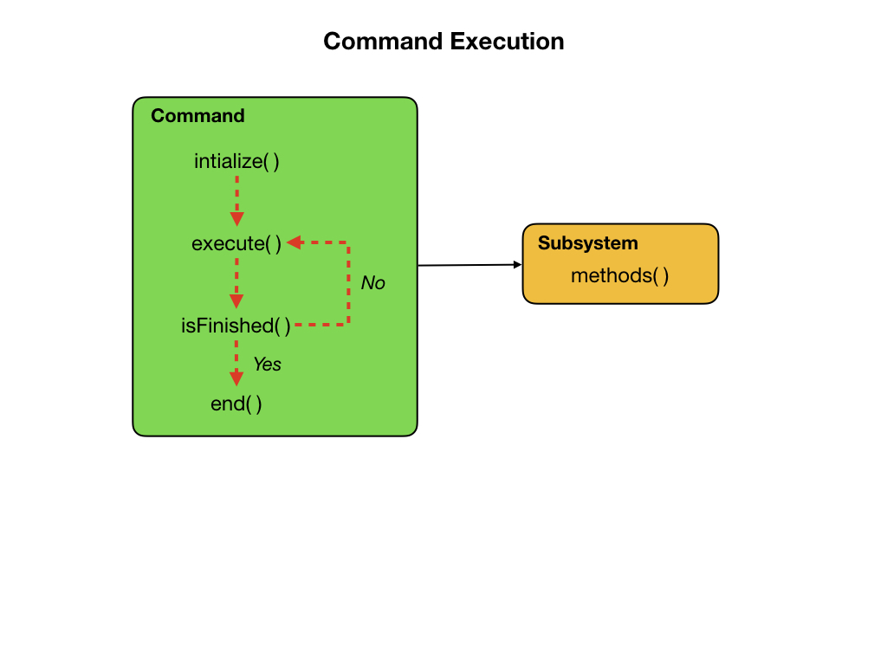

# Lesson 3 - Commands
Commands define high-level robot actions or behaviors that utilize the methods defined by the subsystems. A command is a simple state machine that is either initializing, executing, ending, or idle. Users write code specifying which action should be taken in each state. Subsystems are used by the CommandScheduler resource management system to ensure multiple robot actions are not "fighting" over the same hardware resource. Commands that use a subsystem should include that subsystem in their getRequirements() method.

## The CommandScheduler
Runs the Scheduler.  This is responsible for polling buttons, adding newly-scheduled commands, running already-scheduled commands, removing finished or interrupted commands, and running subsystem periodic() methods.  This must be called from the robot's periodic block in order for anything in the Command-based framework to work.

For more details see [The Command Scheduler](https://docs.wpilib.org/en/latest/docs/software/commandbased/command-scheduler.html) documentation.

## Lab - Create the ArcadeDrive Command
Create a new command called **ArcadeDrive**.  In the VSCode file menu right click on the **commands** folder and select "Create a new class/command".  Enter the name of the command in the box.  This will give you a template for creating your new command. 

    import java.util.function.Supplier;

Add the suppliers

    private final Supplier<Double> m_xaxisSpeedSupplier;
    private final Supplier<Double> m_zaxisRotateSupplier;

Pass the parameters to the ArcadeDrive constructor.  The completed constructor should look like this:

    public ArcadeDrive(
      Drivetrain subsystem,
      Supplier<Double> xaxisSpeedSupplier,
      Supplier<Double> zaxisRotateSuppplier) {
        m_drivetrain = subsystem;
        m_xaxisSpeedSupplier = xaxisSpeedSupplier;
        m_zaxisRotateSupplier = zaxisRotateSuppplier;
        addRequirements(subsystem);
    }

Update the execute() method:

    public void execute() {
      m_drivetrain.arcadeDrive(m_xaxisSpeedSupplier.get(),m_zaxisRotateSupplier.get());
    }
## Add the Joystick
In the `RobotContainer` class create the Joystick object:

    private final Joystick m_controller = new Joystick(0);

Now we'll create a function in the `RobotContainer` class that we'll use the joystick to control the robot:

    public Command getArcadeDriveCommand() {
        return new ArcadeDrive(
            m_drivetrain, () -> -m_controller.getRawAxis(1), () -> m_controller.getRawAxis(2));
      }

## Lab - DriveDistance and TurnDegrees Commands
Add the DriveDistance and TurnDegrees commands.

Configure joystick buttons to run commands.

## Command Groups
Simple commands can be composed into “command groups” to accomplish more-complicated tasks. Commands, including command groups, implement the Command interface.

<h3>
<a href="romiCode2">Previous</a>

<a href="romiCode4">Next</a></h3>