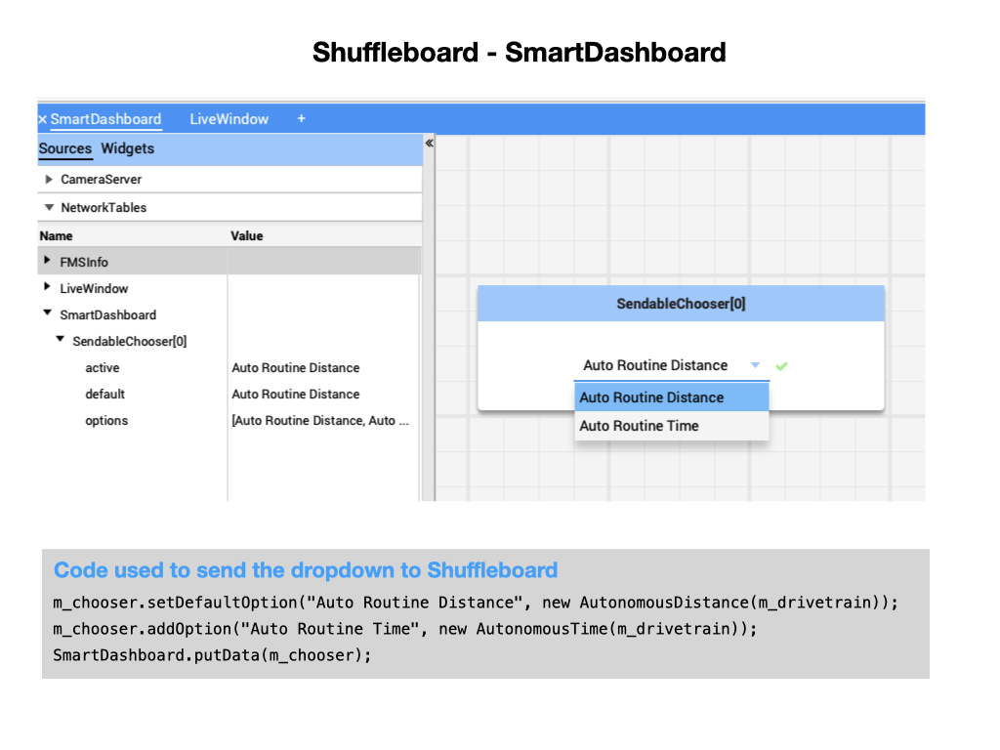

# Romi Development Environment
The Romi Robot is a robot base that can be used by FRC teams preparing for competitions. The kit includes an Arduino compatible 32U4 Control Board and a Raspberry Pi together with  software that is maintained by WPILib.

The control board features two H-bridge motor drivers and is designed to connect to the encoders on the included motors to allow closed-loop motor control. It also includes a powerful 5 V switching step-down regulator that can supply up to 2 A continuously, along with a versatile power switching and distribution circuit. A 3-axis accelerometer and gyro enable a Romi 32U4 robot to make inertial measurements, estimate its orientation, and detect external forces. Three on-board pushbuttons offer a convenient interface for user input, while indicator LEDs, a buzzer, and a connector for an optional LCD allow the robot to provide feedback.

In order to develop programs for the Romi you have to use and IDE, most commonly VSCode.  The code is compiled and executed on your development laptop and uses the WPILib simulation framework to communicate with the Romi robot.  The gamepad will therefore have to synced with you laptop in order to work with the Romi.  The gamepad can be connected to your laptop via BlueTooth.

## Robot Simulator
Explain the simulator.

Here's the documentation for the [Robot Simulator](https://docs.wpilib.org/en/stable/docs/software/wpilib-tools/robot-simulation/introduction.html)

Make sure that desktop support is enabled.

## Shuffleboard

## Raspberry Pi Software

<h3>

<a href="romiExample">Next</a></h3>