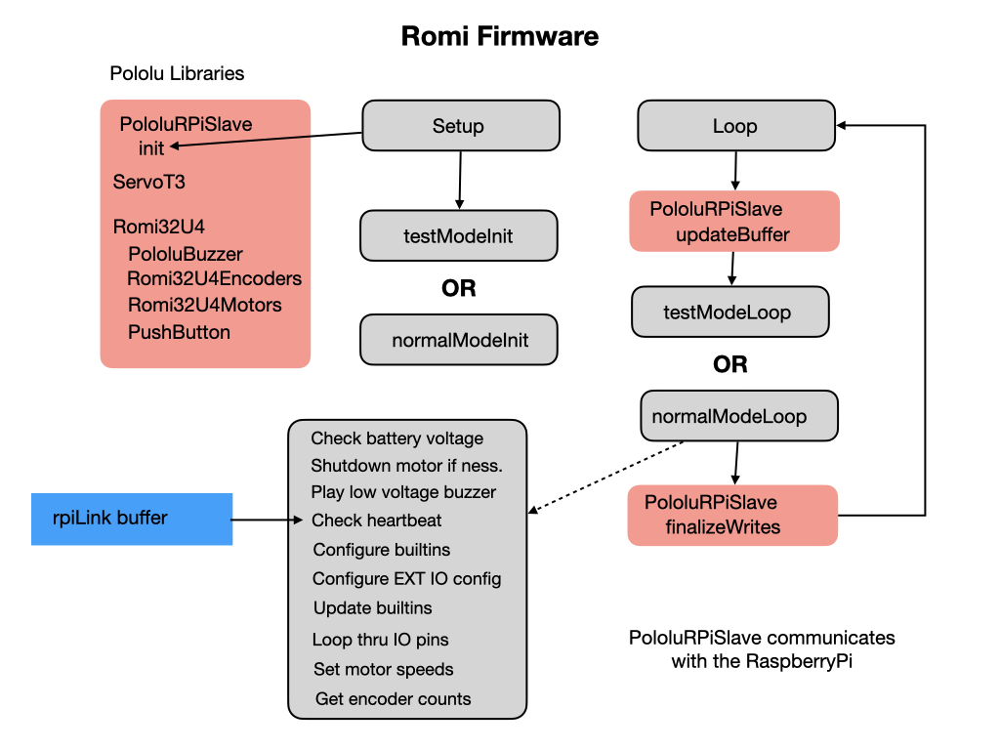

# Micro Controller Firmware
In order to update the Romi Firmware you have to have Platformio installed on your VSCode.  Refer to the [Romi Development Environment](romiDev) for instructions on installing Platformio.  Then follow these steps to load the Romi Firmware into VSCode.

1. Open a Terminal.

2. Download the [Romi Firmware](https://github.com/wpilibsuite/wpilib-ws-robot-romi) using the following command:

    `git clone https://github.com/wpilibsuite/wpilib-ws-robot-romi.git`

3. Change into the `wpilib-ws-robot-rom` folder and drag the `Firmware` folder into VSCode.  

4. Compile the software by clicking the checkmark at the bottom left.

If button A or B is pressed during powerup then the 32U4 enters test mode.

## References 
[Romi Firmware - github](https://github.com/pololu/romi-32u4-arduino-library)
[Romi Firmware README - github](https://github.com/wpilibsuite/wpilib-ws-robot-romi/blob/main/firmware/README.md)

<h3>
<a href="romiPiSoftware">Previous</a>
<!-- 
<a href="romiVision">Next</a></h3> -->