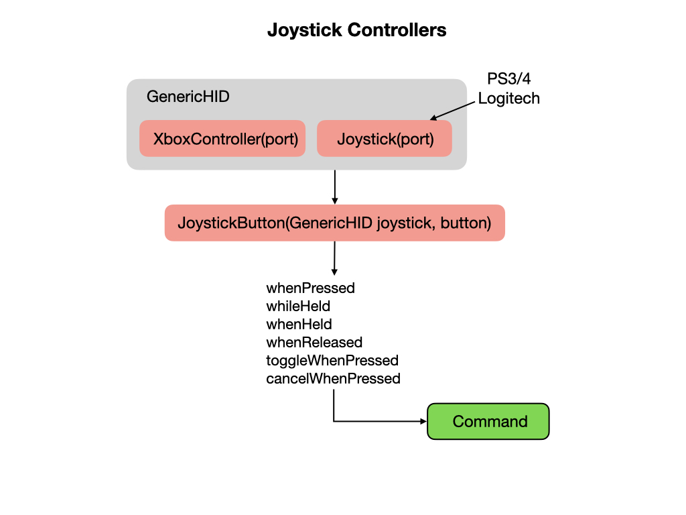

# Joystick Controllers
A joystick/gamepad can be connected to your laptop via a USB port or Bluetooth.  The WPI Library provides all of the necessary software to interface with XBox, PS3/4, or Logitech game controllers.

In the `RobotContainer` class create the Joystick object:

    private final Joystick m_controller = new Joystick(0);

Configure joystick buttons to run commands.

## Slew Rate Filter

<h3>
<a href="romiStructure">Previous</a>

<a href="romiSubsystem">Next</a></h3>