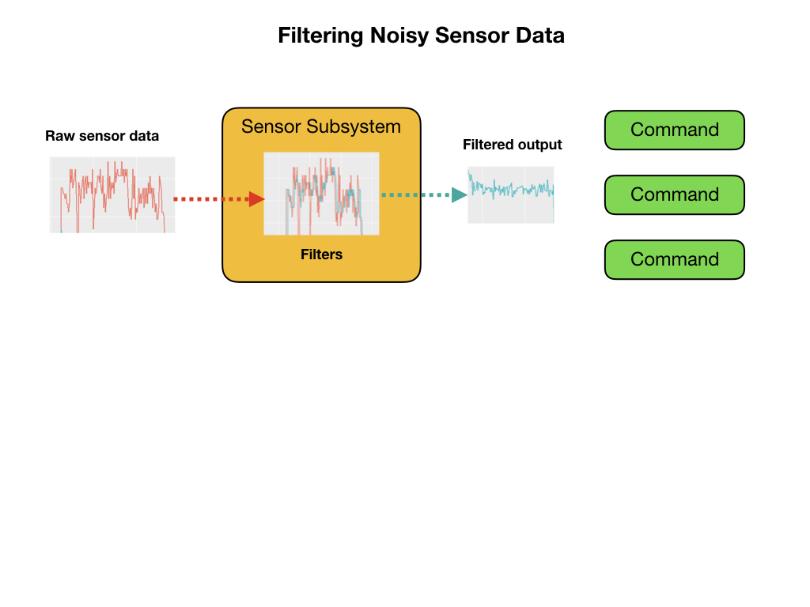

# PID and Line Following
In this lesson we'll learn about PID control and use it to get the Romi to follow a line marked on the floor.  This will make use of the [BasicVision](https://github.com/mjwhite8119/romi-examples/tree/main/BasicVision) code from the previous lesson to send data to our PID controller.  This program will be called [PIDLineFollow](https://github.com/mjwhite8119/romi-examples/tree/main/PIDLineFollow). First we'll code our own simple controller so as we can learn about the basics of PID.  Then we'll implement the PID controller supplied by WPILib.  Before completing this section you should read the [PID Control documentation](https://docs.wpilib.org/en/latest/docs/software/commandbased/pid-subsystems-commands.html) provided by First Robotics.

Our PID command is going to look like the following diagram.  We'll set the **Proportional** part to be 0.015.  Why?  The center line is coming in from the camera and becomes our measurement source.  We need to keep the center line at x=75 so that's becomes the setpoint.  The output is the turn angle going to the left and right motors.  Every command must have a subsystem requirement and in this case it would be the drive train. 

Here are the changes that we'll make to the basic **RomiReference** program.  There will be new subsystem class and two new commands.

Before we add the `Vision` subsystem we'll need to make an update to the `Drivetrain` class.

Update `Drivetrain` Add `steer()` and `stop()` methods.

## Create the Vision Subsystem
Add Vision subsystem code...

Add `Vision` constants to `Constants` file.

Update `RobotContainer` add `Vision` class.

## Home Made PID Controller
As we have learned, the PID controller has three components.  However, we are only going to use the first one which is the **Proportional** part.  Create a new command called `PIDLineFollow`. We'll put our controller in the `execute()` method of our command.

Add `Joystick` constants to `Constants` file. 

Set Joystick and Shuffleboard to initiate the line follow commands.

## WPILib PID Controller

Create a new command called `LineFollowPIDCommand`.
In the RobotContainer class change the Drivetrain definition from `private final` to `public static final`.  Why...?
Use the WPILib `PIDCommand` to control the motors to follow the line.

## Testing the LineFollowing Command
We can test the line following command either by using the joystick or from Shuffleboard.  We'll setup our program to use both methods.  
To use the joystick

To use Shuffleboard add the following code to the `RobotContainer` class.

## References
[FRC Documentation - PID Control](https://docs.wpilib.org/en/latest/docs/software/commandbased/pid-subsystems-commands.html)

[FRC Documentation - Controllers](https://docs.wpilib.org/en/latest/docs/software/advanced-controls/controllers/index.html)

[Testing Commands with Shuffleboard](https://docs.wpilib.org/en/stable/docs/software/wpilib-tools/robotbuilder/introduction/robotbuilder-testing-with-shuffleboard.html)

[Controls Engineering in FRC](https://file.tavsys.net/control/controls-engineering-in-frc.pdf)

<h3>
<a href="romiVision">Previous</a>

<a href="romiServos">Next</a></h3>