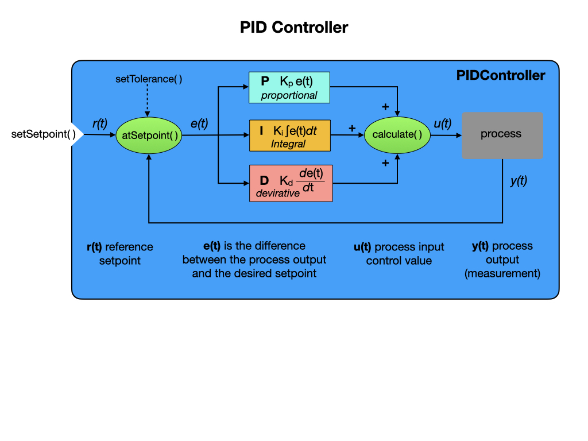
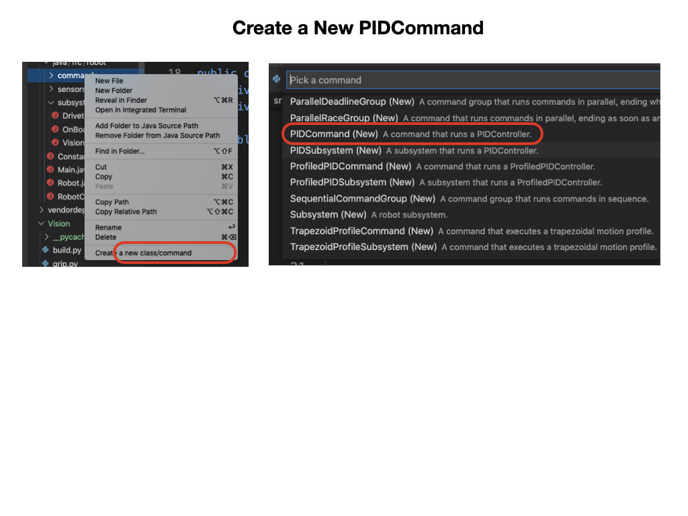
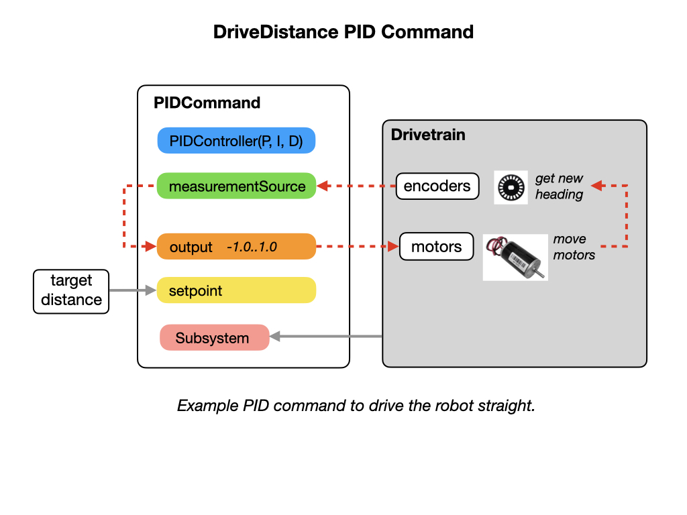

# Motion Control
In this lesson we're going to add a new command that'll give us more control over how the robot moves.  The subject of Motion Control is part of a larger disipline called [Control Systems Engineering](https://en.wikipedia.org/wiki/Control_engineering). We'll just touch the surface of that disipline here and start with some of the basic [Control Systems](https://docs.wpilib.org/en/stable/docs/software/advanced-controls/introduction/control-system-basics.html) terminology.

One of the key Control Systems algorithms is the **PID Controller**, so we'll start with that and see how it can be put it into Commands used by our robot. Finally, we'll learn some basics about tuning a PID Controllers.  

The first command that we'll create will be called *TurnToAngle* that will allow the robot to turn to a specified angle.  After that, we'll create a command to move the robot more smoothly to the desired angle. We'll call this command *TurnToAngleProfiled* and is an example of a methodology called **Motion Profiling**.

## PID Controller
Before looking at the PID controller supplied by the WPI library, it would be useful to get an understanding of what PID control is by watching the [PID Introduction Video by WPI](https://docs.wpilib.org/en/stable/docs/software/advanced-controls/introduction/pid-video.html). A schematic of WPIlib PIDController is below with a detailed explaination found in the [Introduction to PID](https://docs.wpilib.org/en/stable/docs/software/advanced-controls/introduction/introduction-to-pid.html) section of the FRC® documentation.

## The TurnToAngle Command
Under the commands folder right click and select "Create a new class/command".  The select **PIDCommand** from the drop down.

The first thing we need is a **PID Controller** that simply specifies what the P, I, and D values are.  Since these values are constants they should be put in the *Constants* file.  The *PIDController* class is where all of the work is done and was explained in the previous section.

We add the *Drivetrain* as a requirement and tell the command what angle we want to rotate to.  This angle becomes the **setpoint** for the PID controller.  These two parameters are passed in when the *TurnToAngle* constructor is called and our command object is created.

The **measurementSource** and **output** setup a looping arrangement which moves the robot towards the **setpoint**.  In our case, the measurement source is a gyro and the output is sent to the motors in order to turn the robot. Once the setpoint is reached the command will finish.

The full constructor for our **TurnToAngle** command is listed below.

    public class TurnToAngle extends PIDCommand {
    
      public TurnToAngle(double targetAngleDegrees, Drivetrain drive) {
        super(
            // The controller that the command will use
            new PIDController(DriveConstants.kTurnP, DriveConstants.kTurnI, DriveConstants.kTurnD),
            // This should get the measurement
            drive::getHeading,
            // This should return the setpoint (can also be a constant)
            targetAngleDegrees,
            // This uses the output
            output -> {
              // Use the output here
              drive.arcadeDrive(0, output);
            },
            drive);
          
      getController().enableContinuousInput(-180, 180);
      getController().setTolerance(DriveConstants.kTurnToleranceDeg,
                                  DriveConstants.kTurnRateToleranceDegPerS);
  }

 `setTolerance(5, 10)` sets the position and velocity error which is considered tolerable for use with the setpoint. For more details on what we've just done read the [PID Control through PIDSubsystems and PIDCommands](https://docs.wpilib.org/en/latest/docs/software/commandbased/pid-subsystems-commands.html#) section of the FRC® documentation.

### Setting up the Gyro    
There are a few of things we need to do in order to setup the gyro as a measurement source.  

The first is to understand which of the three angles represent the robot's heading.  From our discussion on robot [geometry](../Concepts/geometry) we can see that the heading is represented by the Z-axis.  To make sure that we remember that let's create a wrapper around the Z-axis.

    public double getHeading() {
        return getGyroAngleZ();
      }

Ensure that the gyro is calibrated, which is done on the Romi Website.  Follow the [IMU Calibration](https://docs.wpilib.org/en/stable/docs/romi-robot/web-ui.html#imu-calibration) instructions.

The gyro on the Romi shows continuous angles and does not reset when it reaches 360 degrees.  In order for our PID controller to work we need to reset the angle to zero degrees when it passes 360 or -360 degrees.

`enableContinuousInput(-180, 180)` Rather then using the max and min input range as constraints, it considers them to be the same point and automatically calculates the shortest route to the setpoint.

Lastly, we should reset the gyro angles each time we start the program.  This is done in the Drivetrain constructor where is calls its own `resetGyro()` method.

### Tuning the PID Controller
To get the PID controller to perform properly it will will most likely need to be tuned.  The [Tuning a PID Controller](https://docs.wpilib.org/en/stable/docs/software/advanced-controls/introduction/tuning-pid-controller.html) documentation gives some information on the process.

To tune the PID controller you will need to start Shuffleboard.

View [Testing and Tuning PID Loops](https://docs.wpilib.org/en/stable/docs/software/wpilib-tools/shuffleboard/advanced-usage/shuffleboard-tuning-pid.html)

## The TurnToAngleProfiled Command
With the *TurnToAngle* command there's no way of avoiding the sudden accelerations and changes in velocity, which makes it difficult to tune the PID controller to arrive at the setpoint angle.  It would be better if we can move more smoothly to the setpoint by gradually accelerating and decelerating at the beginning and end of the movement.  A common FRC® controls solution is to pair a [Trapezoidal Motion Profile](../Concepts/timeMotion#TrapezoidProfile) to generate setpoints with a PID controller for tracking the setpoint. To facilitate this, WPILib includes its own *ProfiledPIDController* class.

A major difference between a standard *PIDController* and a *ProfiledPIDController* is that the actual setpoint of the control loop is not directly specified by the user. Rather, the user specifies a goal position or state, and the setpoint for the controller is computed automatically from the generated motion profile between the current state and the goal. 

## References

- FRC Documentation - [PID Basics](https://docs.wpilib.org/en/stable/docs/software/advanced-controls/introduction/index.html)

- FRC Documentation - [PID Control through PIDSubsystems and PIDCommands](https://docs.wpilib.org/en/latest/docs/software/commandbased/pid-subsystems-commands.html#)

- FRC Documentation - [Motion Profiling through TrapezoidProfileSubsystems and TrapezoidProfileCommands](https://docs.wpilib.org/en/latest/docs/software/commandbased/profile-subsystems-commands.html)

- FRC Documentation - [Combining Motion Profiling and PID in Command-Based](https://docs.wpilib.org/en/latest/docs/software/commandbased/profilepid-subsystems-commands.html)

- FRC  Documentation - [PID Control in WPILib](https://docs.wpilib.org/en/stable/docs/software/advanced-controls/controllers/pidcontroller.html)

<h3>
<a href="romiShuffleboard">Previous</a>

<a href="romiPathPlanning">Next</a></h3>