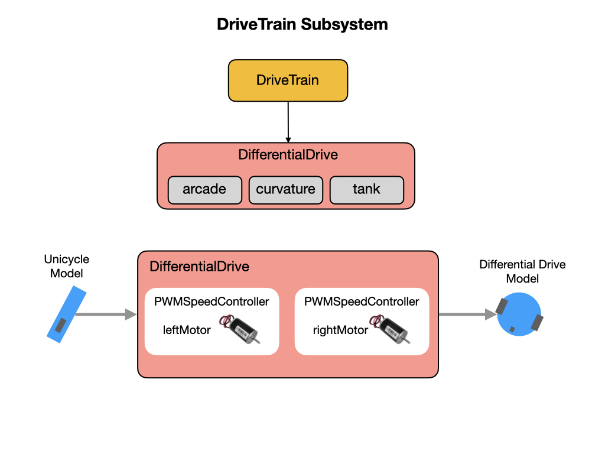

# Subsystems
Subsystems are the basic units of functionally for our robot, such as drive trains and mechanical arms.  They encapsulate low-level hardware objects (motor controllers, sensors, etc) and provide methods that can be used by Commands.  We represent subsystems in code by using [Objects](../Programming/objects). Objects are composed of [Data Structures](../Programming/dataStructures) and [Procedures](../Programming/procedures), as explained in [Introduction to Programming](../Programming/introProgramming). You should learn those concepts before we look at the subsystems that are on the Romi.  

 More information can be found in the [Subsystems](https://docs.wpilib.org/en/latest/docs/software/commandbased/subsystems.html) section of the FRC Documentation.  

## DriveTrain Subsystem
The Romi uses a drive train called a [Differential Drive](https://docs.wpilib.org/en/stable/docs/software/actuators/wpi-drive-classes.html#using-the-differentialdrive-class-to-control-differential-drive-robots). There are three [drive train modes](https://docs.wpilib.org/en/stable/docs/software/actuators/wpi-drive-classes.html#drive-modes) that can be implemented. The Romi uses the **Arcade** drive mode. To understand what type of maneuvers are possible using a Differential Drive robots we need to learn a little bit about [Kinematics](../Concepts/kinematics).

The primary job of the **Drivetrain** subsystem is to send speed commands to its motors.  This is done in the `arcadeDrive()` method where we pass in the required translational and rotational speed.  The **DifferentialDrive** object will take care of controlling the speed to the left and right motors based on the kinematics of the drivetrain type. 

    public void arcadeDrive(double xaxisSpeed, double zaxisRotate) {
        m_diffDrive.arcadeDrive(xaxisSpeed, zaxisRotate);
      }

Other procedures in the Drivetrain class will take care of resetting and reading the wheel encoders.  It'll also translate the wheel encoder values into distances, as explained in the [Robot Odometry](../Concepts/odometry) section.

## RomiGyro Subsystem
The RomiGyro subsystem reads values from its gyro in order to perform [Robot Localization](../Concepts/localization). The raw data that comes from gyros is very complex and difficult to intepret.  The RomiGyro subsystem translates the data into simple angles and rates-of-turn that are much easier to understand.

## The periodic( ) method
This method is called periodically by the CommandScheduler. Useful for updating subsystem-specific state that you don't want to offload to a Command. Teams should try to be consistent within their own codebases about which responsibilities will be handled by Commands, and which will be handled here.

## The register( ) method 
 Subsystems must be registered with the scheduler with the CommandScheduler's `registerSubsystem()` method in order for the Subsystem `periodic()` method to be called. It is recommended that this method be called from the constructor of users' Subsystem implementations. The SubsystemBase class offers a simple base for user implementations that handles this.

## References

- FRC Documentation - [Subsystems](https://docs.wpilib.org/en/latest/docs/software/commandbased/subsystems.html)

- FRC Documentation - [Differential Drive Robots](https://docs.wpilib.org/en/stable/docs/software/actuators/wpi-drive-classes.html)

- QUT Robot Academy [Measuring Motion](https://robotacademy.net.au/masterclass/measuring-motion/)

<h3>
<a href="romiCode1">Previous</a>

<a href="romiCode3">Next</a></h3>