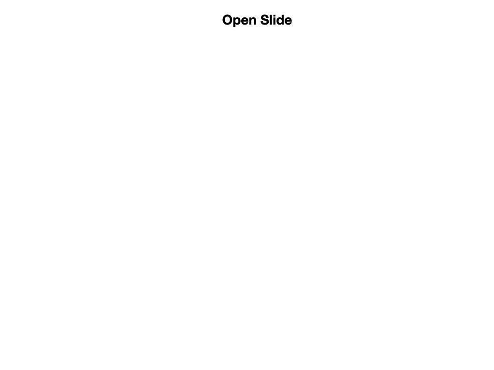

# Vision Programming
Explain camera server and filtering ...

## GRIP
On Mac start from Applications->GRIP
Turn on the Romi
Add Source -> IP Camera.  Put the URL of the camera stream.  wpilibpi.local:1181/stream.mjpg
Follow FRC documentation to create the filter.
The last filter must should be Filter Contours.
Generate the code Tools->Generate Code.  Put it in your java main directory of your project.
Change the class definition.  It must implement VisionPipeline.
cd ~/Documents/romi-examples/java-multiCameraServer
./gradlew build
On the Romi WPILibPi.local webpage go to Application.
Put into Writable mode
Select "Uploaded Java jar" in the dropdown
Upload the file build/libs/java-multiCameraServer-all.jar
Run the Simulator

<h3>
<a href="romiFirmware">Previous</a>