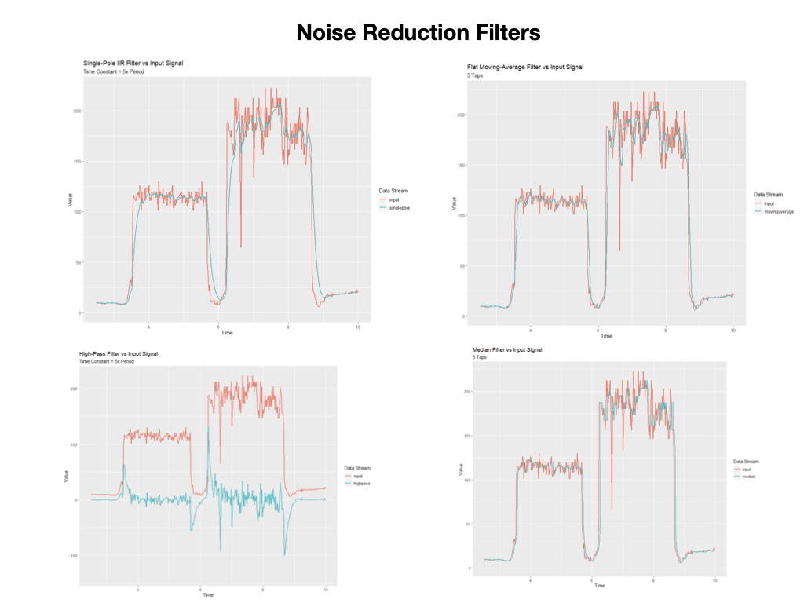

# Vision Programming
In this section we'll make use of the Raspberry Pi camera that's installed on the Romi.  The camera will recognize a line drawn on the ground.  The line should be a distinctive color that doesn't blend in with the surrounding colors.  During this lesson we'll decide on a color and tune the camera in to lock onto that color.  Once we've "locked on" to the color we'll draw a center line on the camera image so as we can follow the line. The camera server will use [Network Tables](https://docs.wpilib.org/en/latest/docs/software/networktables/index.html) to send data to the [Simulator](https://docs.wpilib.org/en/latest/docs/software/wpilib-tools/robot-simulation/index.html) and [Shuffleboard](https://docs.wpilib.org/en/latest/docs/software/dashboards/shuffleboard/index.html).  

The camera program uses the open source software called [OpenCV](https://opencv.org/) and can be written in Java, Python, or C++.  We're going to use the Python programming language since most of the OpenCV programming examples that you'll find online will use Python, so if you run into any problems with your program chances you'll find the solution in Python.  The following diagram shows the software components that we're going to use and how they're deployed between the Romi and your development PC. 

For this lesson we'll use the [BasicVision](https://github.com/mjwhite8119/romi-examples/tree/main/BasicVision) project.  Clone this project to VSCode.  The **BasicVision** project uses the WPI example project **RomiReference** to run and view the camera data in the Simulator and Shuffleboard.  There are no changes made to the **RomiReference** code.

The python code for running the camera has been included in this project so as we have both of the software components in one place.  You'll upload the camera program to the Raspberry Pi on the Romi in a later step.  The following sections explain how the program works and how you deploy and run it.

## Using GRIP to Recognize the Line
In the above diagram you can see the camera sending frames to a piece of code called **GripPipeline**.  This code is generated from the FRC tool called [GRIP](https://docs.wpilib.org/en/latest/docs/software/vision-processing/grip/index.html).  A major part of this lesson will be to learn the GRIP tool and create a pipeline to process images coming from the camera.

1. On Mac start from Applications->GRIP
2. Turn on the Romi
3. Add Source -> IP Camera.  Put the URL of the camera stream.  wpilibpi.local:1181/stream.mjpg
4. Follow [FRC GRIP documentation](https://docs.wpilib.org/en/latest/docs/software/vision-processing/grip/index.html) to create the filter.
The last filter should be `Find Contours`.
5. Generate the code Tools->Generate Code.  
6. Select Python as the output language.
7. Use `GripPipeline` as the class name.
8. Put it into the `Vision` directory of your project.
9. Name the module `grip`.

<!-- If you're generating the java pipeline version make sure the the "Implement WPILIB VisionPipeline" box is checked.  This will place the following code into the generated GRIP file: -->

    import edu.wpi.first.vision.VisionPipeline;

The class definition will look like this:

    public class GripPipeline implements VisionPipeline {

## Update your Camera Server Program
You'll need to upload a program to the Raspberry Pi on the Romi in order to run the camera.

Need slide of application upload...

### Display the Tracking View in Shuffleboard
Shuffleboard uses the Network Tables to display the camera data so your java program must be running in order to see the live camera stream.

## Upload Python Program
1. cd ~/Documents/romi-examples/BasicVision/Vision
2. The python program has multiple files so you need to upload them all.  This is done with a zip file.  Run `python3 build.py` to build the zip file.
3. On the Romi WPILibPi.local webpage. Go to **Application**.
4. Put Raspberry Pi file system into Writable mode.
5. In the **Vision Application Configuration** section select "Uploaded Python File" from the dropdown menu.
6. In the **File Upload** section select the file `wpilib.tar.gz` file for upload.  Make sure that file **Extract** is selected. Click the **Upload** button.

<!-- 6. Select "Uploaded Python file" in the dropdown.
7. Select multiCameraServer.py for the file.  You only need to upload this if you change it, which shouldn't be very often.  -->

<!-- ## Upload Java Program
1. cd ~/Documents/romi-examples/java-multiCameraServer
2. run `./gradlew build` to build the jar file.  Make sure that the build is successful.
3. On the Romi WPILibPi.local webpage, click on **Application** in the left panel.
4. Put into Writable mode
5. Select "Uploaded Java jar" in the dropdown.
6. Click on **Choose File** file and upload the file `build/libs/java-multiCameraServer-all.jar`. -->

## Test your Program
Run the your java program from VSCode by pressing the F5 key. In the **Simulator** you will see the Network Tables showing the `targetData` coming in from the python camera server program.  You can use this data to control the robot.
1. Connect the Joystick and drag it from **System Joysticks** window to the **Joysticks** window.
2. Put the robot in **Teleoperated** mode.
3. Press the joystick START button to run your custom PID line following routine.
3. Press the joystick SELECT button to run the WPI `PIDCommand` line following routine.

## Notes on Restarting the Romi
When you first turn the Romi on the Application will default to "Custom".  You have to switch it to run the the your Python camera program and restart it: 
1. Go to the Application tab and switch the application from "Custom" to "Uploaded Python File" 
2. Go to the **Vision Status** tab and click on the "Down" button.
3. Click the Enable button on the Console Output so as you can see the vision status as the program starts up.
4. Click on the "Up" button to restart the application, and observe the output to make sure it restarts successfully.
5. In VSCode start you java program by pressing F5.  This will start the **Simulator** which is responsible for starting the Network Tables.  The Network Tables are used to stream the camera data.

Caution:
The runCamera file keeps getting overwritten when you upload a new multiCameraServer.py file.  So just upload the tar file and then `Terminate` the application on the **Vision Status** page, and then press the `Up` button.

## References
[OpenCV](https://opencv.org/)

[GRIP documentation](https://docs.wpilib.org/en/latest/docs/software/vision-processing/grip/index.html)

[Robotpy examples - github](https://github.com/robotpy/robotpy-cscore/tree/main/examples)

<h3>
<a href="romiFirmware">Previous</a>