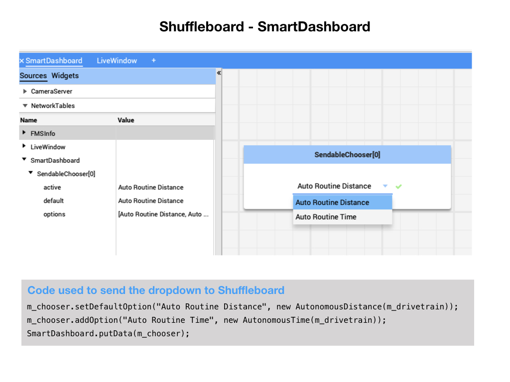
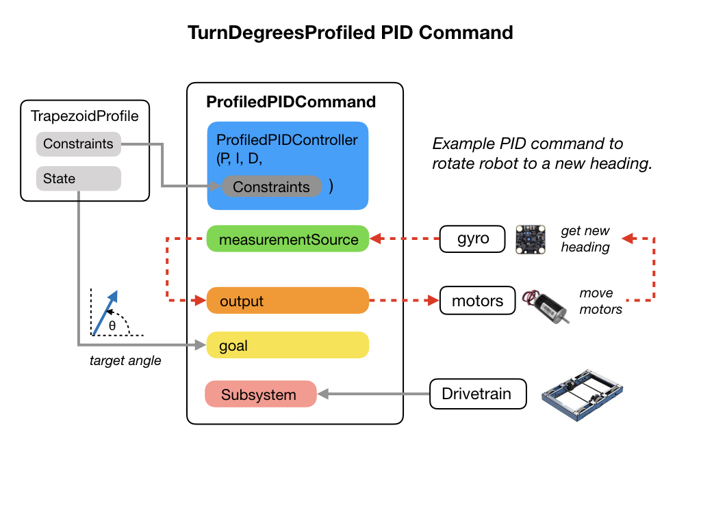

# Shuffleboard
When creating Commands and Subsystems for our robot it'll be necessary to see the data that's getting generated.  Remember that robots are data driven machines, so in order to test our code we'll need to see the data.
For that purpose we'll be using WPI tool called **Shuffleboard**, which will allow us to view all of the data coming from the robot in real time.

The documentation explains how to [start Shuffleboard](https://docs.wpilib.org/en/stable/docs/software/wpilib-tools/shuffleboard/getting-started/shuffleboard-tour.html#starting-shuffleboard) depending on your development laptop.

A lot of the data from our robot gets placed onto Shuffleboard automatically.  Let's see what we get for free from the **romiReference** project when we start Shuffleboard. There are two default tabs **SmartDashboard** and **LiveWindow**. More tabs will be added as we add more functionally to our project.  On the right side of the Shuffleboard display you'll see the **Sources** area.  These are explained in detail in the [Shuffleboard](https://docs.wpilib.org/en/stable/docs/software/wpilib-tools/shuffleboard/index.html) documentation but let's go through these in the context of the Romi project. 

## SmartDashboard
The WPI tool **SmartDashboard** has been around for a while and provides class methods in order to interact with **Shuffleboard** from your program.  Shuffleboard is a newer tool that has a default tab to support the original SmartDashboard functionality.  To get data onto Shuffleboard you use the `putData()` method in the SmartDashboard class in your program.  This data will show up in the SmartDashboard tab and also in the **Sources** area of Shuffleboard.  In our Romi example SmartDashboard has the Dropdown to select an Autonomous command.  This was put there from the `configureButtonBindings()` method of **RobotContainer**. 

## LiveWindow
The LiveWindow tab shows all the autogenerated debugging values grouped in subsystems.

In the display shown below the objects listed as *Ungrouped* were implicitly created by WPILib when the corresponding objects were created. These objects are named with the device type (Encoder, DifferentialDrive, Accelerometer, DigitalIn, DigitalOut), the module and channel numbers. These data values are updated every 20 milliseconds, so you can see what's happening on the robot in real time.

## How LiveWindow gets Populated
The *SendableRegistry* class is the public interface for registering sensors and actuators for use on dashboards and LiveWindow.  This can be done in the constructor of the class.  The code below shows how this is done in the *DifferentialDrive* class.

    public DifferentialDrive(SpeedController leftMotor, SpeedController rightMotor) {
        verify(leftMotor, rightMotor);
        m_leftMotor = leftMotor;
        m_rightMotor = rightMotor;
        SendableRegistry.addChild(this, m_leftMotor);
        SendableRegistry.addChild(this, m_rightMotor);
        instances++;
        SendableRegistry.addLW(this, "DifferentialDrive", instances);
      }

The code below is from the DifferentialDrive class and shows how it get registered with Shuffleboard.

    public void initSendable(SendableBuilder builder) {
      builder.setSmartDashboardType("DifferentialDrive");
      builder.setActuator(true);
      builder.setSafeState(this::stopMotor);
      builder.addDoubleProperty("Left Motor Speed", m_leftMotor::get, m_leftMotor::set);
      builder.addDoubleProperty(
          "Right Motor Speed",
          () -> m_rightMotor.get() * m_rightSideInvertMultiplier,
          x -> m_rightMotor.set(x * m_rightSideInvertMultiplier));
    }

## Using Tabs
Note: keys that match more than one Source prefix will appear in both tabs. Because those keys also start with SmartDashboard/ and that’s the Source prefix for the default SmartDashboard tab, those widgets will appear in both panes. To only have values appear in one pane, you can use NetworkTables to write labels and values and use a different path that is not under SmartDashboard. 

## References

- FRC Documentation - [Shuffleboard](https://docs.wpilib.org/en/stable/docs/software/wpilib-tools/shuffleboard/index.html)

<h3>
<a href="romiCode4">Previous</a>

<a href="romiCode6">Next</a></h3>