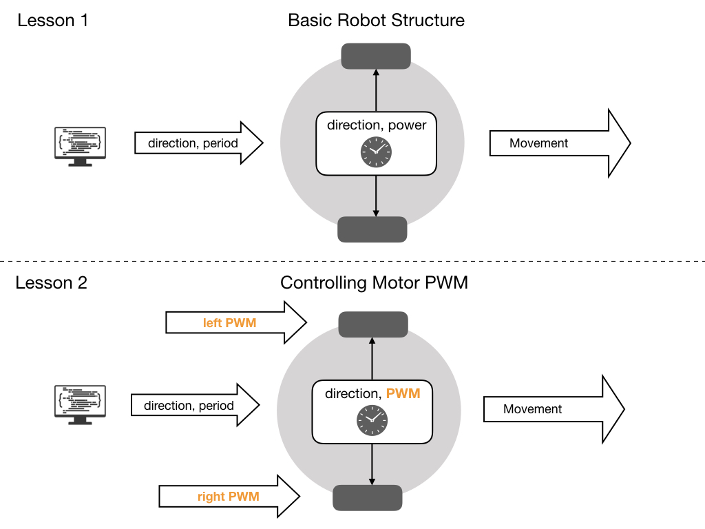
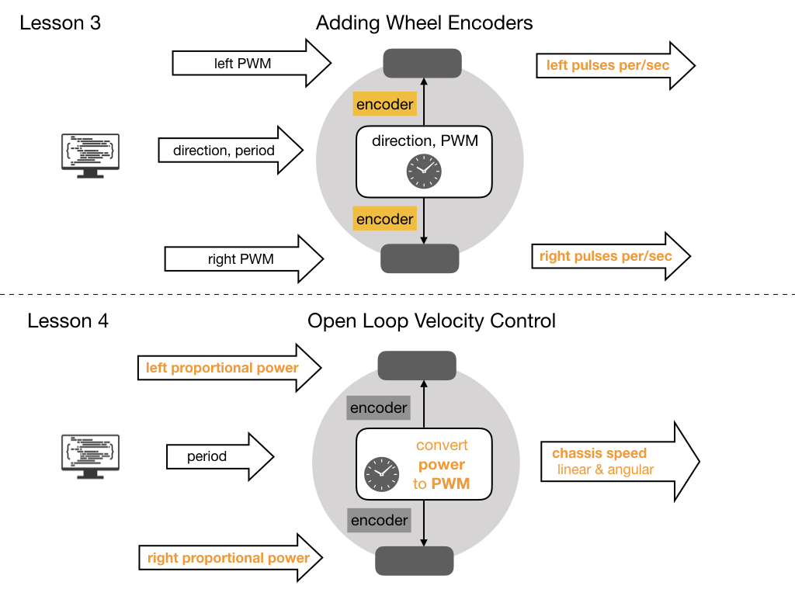
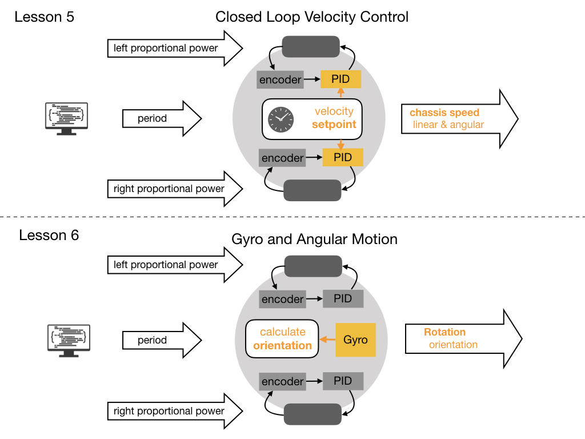

# BabyBot a Training Robot for FRC Programming Teams
The <i>BabyBot</i> is designed to be used as a teaching tool for programming teams involved in the <i>First Robotics Competition (FRC)</i>.  The code for this robot can be found in the [BabyBot Github Repository](https://github.com/mjwhite8119/FRCRobot). There are multiple <i>Git</i> code branches in this repository and each branch builds on the previous one to create a functioning mobile robot. A key component of any mobile robot is its <i>Odometry</i> system.  Odometry involves using sensors on the robot to create an estimate of the position of the robot on the field.  The following diagrams show the pregression of lessons.  Each new piece of functionality is highlighted in orange.

The first lesson creates the **Basic Robot Structure** that will be used throughout the course. Each lesson will build on this basic structure to add more functionality. Basic commands are sent to the robot to make it move for a certain period of time.

The second lesson enables the speed of the motors to be controlled using **PWM** signals that are sent to each wheel.  In this lesson you'll see how changing the PWM signal effects the power sent to the motor and therefore the speed.   

Adding **Wheel Encoders** to our robot is done in lesson 3. These will enable us to more precisely control the velocity and position of the robot in future lessons.  The OLED display will show the number of encoder pulses that are recorded per second.

Now that we have wheel encoders we can **Control the Velocity** of the robot, which we do in lesson 4.  We can tell the robot what velocity to travel at instead of sending power commands. A conversion from velocity values to PWM values is the main feature of this code update. The OLED will now display the robots' velocity instead of the number of encoder pulses.

Lesson 5 sets up a **PID Loop** to control each individual motor so as the robot will travel in a straight line. Each motor is different and requires a different power level to produce a desired speed.  The PID loop is designed to take care of this.

When we get to lesson 6 we'll have all the pieces that we need to setup our **Odometry** system. Odometry involves using sensors to estimate the position of the robot on the field.  To describe the data coming from our odometry we introduce the concept of a <i>Pose</i>. This is a data structure that holds the robots' position and orientation.

Lesson 7 brings a **Gyro** into our robot system.  A gyro is used to keep track of the orientation of the robot.  Since our robot only operates in a 2D plane we only need to know one of the three orientation values.  For wheeled robots the orientation is also referred to as the heading.

Finally in lesson 8, we will combine the encoders and gyro together to give us a complete picture of the robots position and orientation.  Although it's possible to calculate the robots' heading using just the encoders, the gyro can give us a more accurate estimate of heading and is commonly used in FRC.  The combining of multiple sensors into our odometry system is called **Sensor Fusion**.

So that's the plan. The code is installed on a small Arduino based training robot that uses an ESP32 microcontroller.  The Bill-of-Materials and construction of this robot is described below. To setup the development environment and start the lessons follow the these links:

- [Development Environment Setup](ide)
- [Lesson 1 - Basic Robot Structure](code1)
- [Lesson 2 - Controlling Motor PWM](code2)
- [Lesson 3 - Adding Wheel Encoders](code3)
- [Lesson 4 - Open Loop Velocity Control](code4)
- [Lesson 5 - Closed Loop Velocity Control](code5)
- [Lesson 6 - Odometry](code6)
- [Lesson 7 - Gyroscope and Angular Motion](code7)
- [Lesson 8 - Sensor Fusion](code8)

## Hardware Components and Contruction
To build the robot for these lessons you will need to get the following components and follow the construction steps:

- [Hardware Bill-of-Materials](bom)
- [BabyBot Construction & Wiring Diagram](build)

<h3>
<a href="../index">Home</a>

<a href="ide">Next</a></h3>