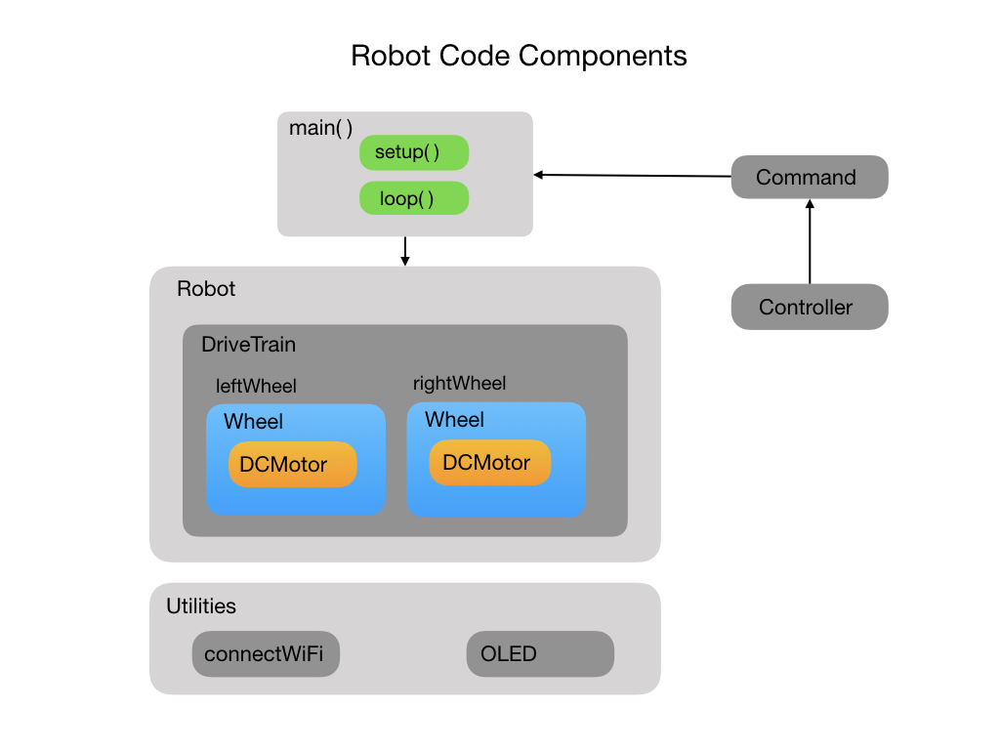

# Training Robot for FRC Programming Teams
The <i>Training Robot</i> is designed to be used as a teaching tool for programming teams involved in the <i>First Robotics Competition</i>.  FRCRobot code in the master branch is the introductory level code and should be installed first to begin the course. This introductory level code creates the basic structure of the robot that will be used throughout the course of training. The FRCRobot code has multiple <i>Git</i> branches.  Each branch will build on this basic structure to add more functionality. 

The code is installed on a small Arduino based training robot.  The Bill-of-Materials and construction of this robot is described below.

- [Development Environment Setup](#ide)
- [Code Description](#code)
- [Hardware Bill-of-Materials](#bom)
- [Robot Construction](#build)
- [Wiring Diagram](#wiring)

# Development Environment Setup
The code must be run on an ESP32 NodeMCU development board, which is an embedded Arduino based microcontroller with built-in WiFi.  For the development environment (IDE) we'll be using VSCode.  This is the IDE most commonly used by <i>First Robotics</i> teams.  In order to install code onto the ESP32 microcontoller you have to install the PlatformIO plugin for VSCode. The PlatformIO plugin install is explained in this [YouTube video](https://www.youtube.com/watch?v=5edPOlQQKmo)

Once you have the PlatformIO plugin installed the FRCRobot code can be cloned from Github following these instructions:
- From VSCode go to `View->Command Palette`.
- Type in `git clone` ,which will bring up a text box.
- Put in https://github.com/mjwhite8119/FRCRobot1.git and press enter.
- You'll then be prompted to enter a directory location on your local machine in which to store the project.
- Finally, open the project in VSCode.

# Code Description
A diagram of the major code components for FRCRobot1 is shown below. The main program unit calls utility functions to connect to WiFi and bring up a Web Server on it's IP address.  The IP address and WiFi connection status is shown on an OLED display.  The Web Server is used to interact with the robot.

The main program creates a <i>Robot</i> class that is composed of a <i>DriveTrain</i> with a left and right <i>Wheel</i>.  Each wheel has it's own <i>DCMotor</i>.  This sets up a differential drive configuration for the robot.

This first program implements some very basic functionality.  You can move the robot forward and backward, and have it turn left or right. Because two motors are never the same the robot will most likely not move in a straight line.  This can only be solved by using wheel encoders and a PID loop. This will be implemented in the next code levels.

# Hardware Bill-of-Materials
The links in this BOM will show multiple pieces for most products.  It's assumed that teams will want to build more than one robot and this will reduce the cost per unit. Single pieces are available but at a higher cost per item.  Most items come with the screws and wires. Some additional hardware items maybe required.
- [ESP32 ESP-32S WiFi Development Board NodeMCU-32S](https://www.amazon.com/dp/B086MGH7JV/?coliid=I25TTO5GWWP44Q&colid=18A3P3KX2X6RJ&psc=1&ref_=lv_ov_lig_dp_it)
- [L298N Motor Drive Controller Board](https://www.amazon.com/gp/product/B07PDDZM9L/ref=ppx_yo_dt_b_asin_title_o02_s00?ie=UTF8&psc=1)
- [DC Motor Wheel Kit](https://www.amazon.com/dp/B081W176PL/?coliid=I2H12T7AI2ENJS&colid=18A3P3KX2X6RJ&psc=1&ref_=lv_ov_lig_dp_it)
- [Optical Encoder Sensor for Motor Speed Detection](https://www.amazon.com/dp/B081W4KMHC/?coliid=I1OIKZCDSA96CD&colid=18A3P3KX2X6RJ&psc=1&ref_=lv_ov_lig_dp_it)
- [6DOF MPU6050 Module 3 Axis Gyroscope + Accelerometer Module](https://www.amazon.com/dp/B06XW9ZSC8/?coliid=I33S53IKDA4YTC&colid=18A3P3KX2X6RJ&psc=1&ref_=lv_ov_lig_dp_it)
- [I2C Display Module 0.91 Inch](https://www.amazon.com/dp/B08CDN5PSJ/?coliid=IPPZF5KYF3ZDQ&colid=18A3P3KX2X6RJ&psc=1&ref_=lv_ov_lig_dp_it)
- [18650 Battery Holder with ON/Off Switch](https://www.amazon.com/gp/product/B071DF4ZFG/ref=ppx_yo_dt_b_asin_title_o04_s00?ie=UTF8&psc=1)
- [Samsung 25R 18650 2500mAh 20A Battery](https://www.18650batterystore.com/18650-p/samsung-25r-18650.htm?gclid=CjwKCAjwkoz7BRBPEiwAeKw3q0UdWyndKWW0d0Z4SdPLWF9pgRI892BRPVXSbqOe6H6sriTIbdVDzhoC-gMQAvD_BwE)
- [1" Caster Wheels Single Wheel Swivel Casters](https://www.amazon.com/gp/product/B07TXP54KG/ref=ppx_yo_dt_b_asin_title_o00_s00?ie=UTF8&psc=1)
# Robot Construction
Well, here's what I have so far... Probably not the final build but it shows all of the hardward components that will be on the robot.

# Wiring Diagram
Yep! as soon as I have a final build.
