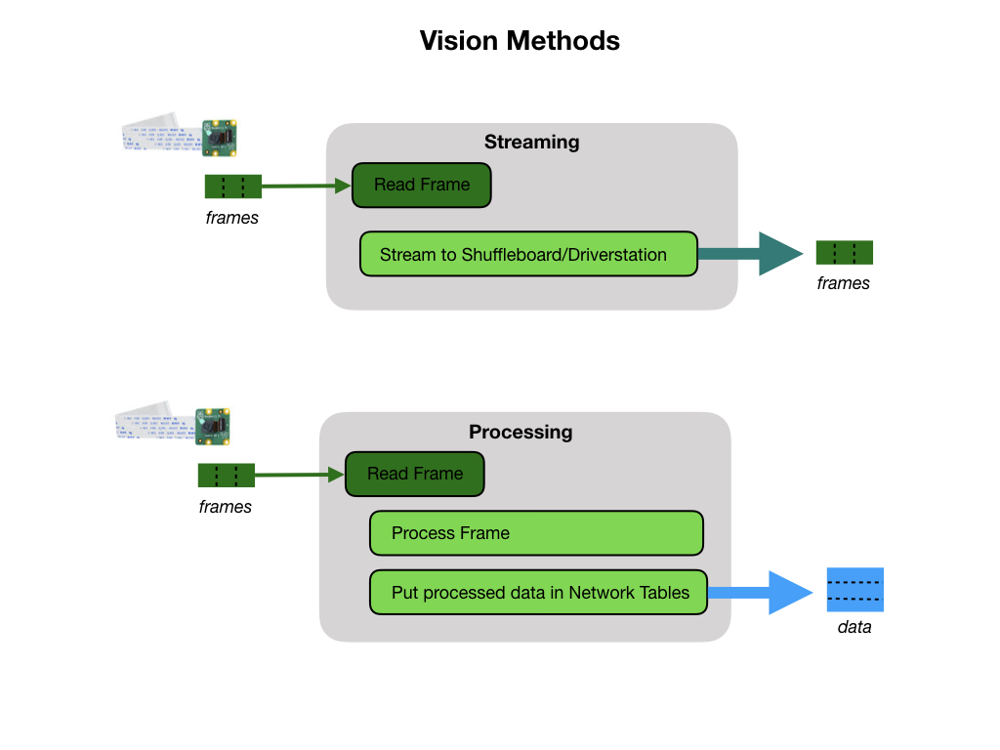

## Introduction to Robot Vision
Camaras are cheap

Processing power is getting cheaper all the time.

Used for self driving cars.

AI deep learning networks.

There are various [Strategies for Vision Programming](https://docs.wpilib.org/en/stable/docs/software/vision-processing/introduction/strategies-for-vision-programming.html) that we can use.  The strategy that we'll make use of is the Raspberry Pi as a co-processor which uses the [WPILibPi](https://docs.wpilib.org/en/stable/docs/software/vision-processing/wpilibpi/index.html) library for vision processing.

We will use the camera for two purposes:

- **Streaming** - This method involves streaming the camera to the Driver Station so that the driver and manipulator can get visual information from the robot’s point of view.

- **Processing** - Instead of only streaming the camera to the Driver Station, this method involves using the frames captured by the camera to compute information, such as a game piece’s or target’s angle and distance from the camera. 

On the FRC game field they will use [Retroflective](https://docs.wpilib.org/en/stable/docs/software/vision-processing/introduction/target-info-and-retroreflection.html) tape to identify targets. We'll use [Image Processing](imageProcessing) to determine the location and distance of the target and act accordingly.  Image processing is done using an FRC application called *GRIP*.

## Using GRIP
You can download GRIP from the [GRIP Releases](https://github.com/WPIRoboticsProjects/GRIP/releases) link.  Scroll to the botton of the page and select the install for your computer.  The FRC documentation [Vision with GRIP](https://docs.wpilib.org/en/stable/docs/software/vision-processing/grip/index.html) details its use.

## References
- FRC Documentation - [Introduction to Vision](https://docs.wpilib.org/en/stable/docs/software/vision-processing/introduction/what-is-vision.html)

- FRC Documentation - [Strategies for Vision Programming](https://docs.wpilib.org/en/stable/docs/software/vision-processing/introduction/strategies-for-vision-programming.html)

- QUT Robot Academy [Robot Vision](https://robotacademy.net.au/masterclass/robotic-vision/)

- Peter Corke Lecture - [Introduction to Robot Vision](https://www.youtube.com/watch?v=N_a6IP6KUSE&list=PL1pxneANaikCO1-Z0XTaljLR3SE8tgRXY)

<h3>
<a href="../index">Home</a>

<a href="control">Next</a></h3>