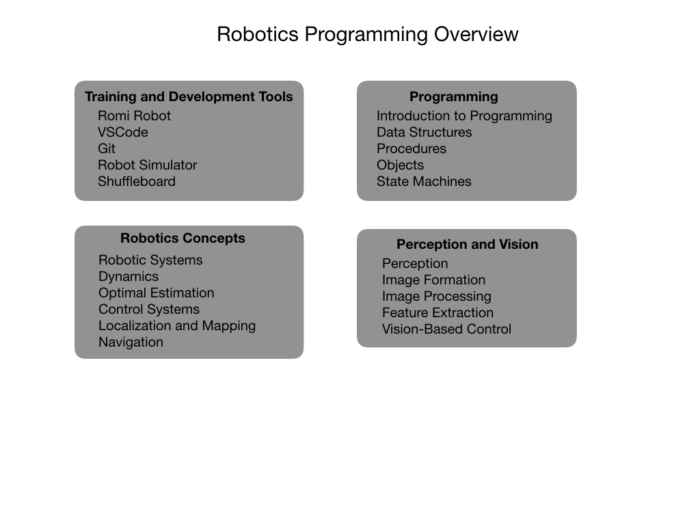

# Robotics Programmer Training

This site hosts training resources for teams involved in the First Robotics Competition (FRC). The aim is to give student a good grounding in both robotics and programming.  The outline of the course is based on the book [Robotics, Vision and Control](https://petercorke.com/rvc/home/) by Peter Corke, together with a lot of references to the documentation shown on the [FIRST Robotic Competition](https://docs.wpilib.org/en/latest/index.html) Website.  The purpose of the training is to take you step-by-step through the process of becoming an FRC programmer.  This will prepare you to write code for the competition robot that your mechanical and electrical engineering teams will build. The FRC documentation is very comprehensive so there will be many links to it at the appropriate points.  

The subjects that will be covered in this course will include:

The main [learning path](learningPath) is the **Romi Training Robot**.  From there we'll link to other parts of the training resources.

So let's get started.

- Training Tools 
  - [Romi Training Robot](Romi/romi.md)

- Development Tools 
  - [VSCode](Tools/VSCode.md)
  - [Git](Tools/git.md) 
  - [Robot Simulator](Tools/simulator.md)
  - [Shuffleboard](Tools/shuffleboard)
  <!-- - [BabyBot](Tools/trainingRobot.md) -->
- Programming
  - [Introduction to Programming](Programming/introProgramming)
  - [Data Structures](Programming/dataStructures)
  - [Procedures](Programming/procedures)
  - [Objects](Programming/objects)
  - [State Machines](Programming/stateMachines)

  <!-- - [Computer Science](Programming/csIndex) -->

- Robotics Concepts
  - [Robotic Systems](Concepts/RobotSystem/robotSystemsIndex)
  - [Dynamics](Concepts/Dynamics/dynamicsIndex)
  - [Optimal Estimation](Concepts/OptimalEstimation/optimalEstimationIndex)
  - [Control Systems](Concepts/Control/controlIndex)
  - [Localization and Mapping](Concepts/LocalizationMapping/localization)
  - [Navigation](Concepts/Navigation/navigation)
  
- Vision  
  - [Introduction to Vision](Vision/introVision.md)
  - [Light & Color](Vision/lightColor)
  - [Image Formation](Vision/imageFormation)
  - [Image Processing](Vision/imageProcessing)
  - [Feature Extraction](Vision/featureExtraction)
  - [Vision-Based Control](Vision/controlVision)

## References
- [FIRST Robotic Competition Website](https://docs.wpilib.org/en/latest/index.html)

- [Controls Engineering in the
FIRST Robotics Competition](https://file.tavsys.net/control/controls-engineering-in-frc.pdf) - Tyler Veness 

- [Robotics, Vision and Control](https://petercorke.com/rvc/home/) - Peter Corke

- [Mobile Robotics](https://www.cambridge.org/core/books/mobile-robotics/5BF238489F9BC337C0736432C87B3091) Alonzo Kelly

- [W3Schools](https://www.w3schools.com/java/default.asp) - Java Tutorial 

- [Romi Example Code](https://github.com/mjwhite8119/romi-examples) Github 
