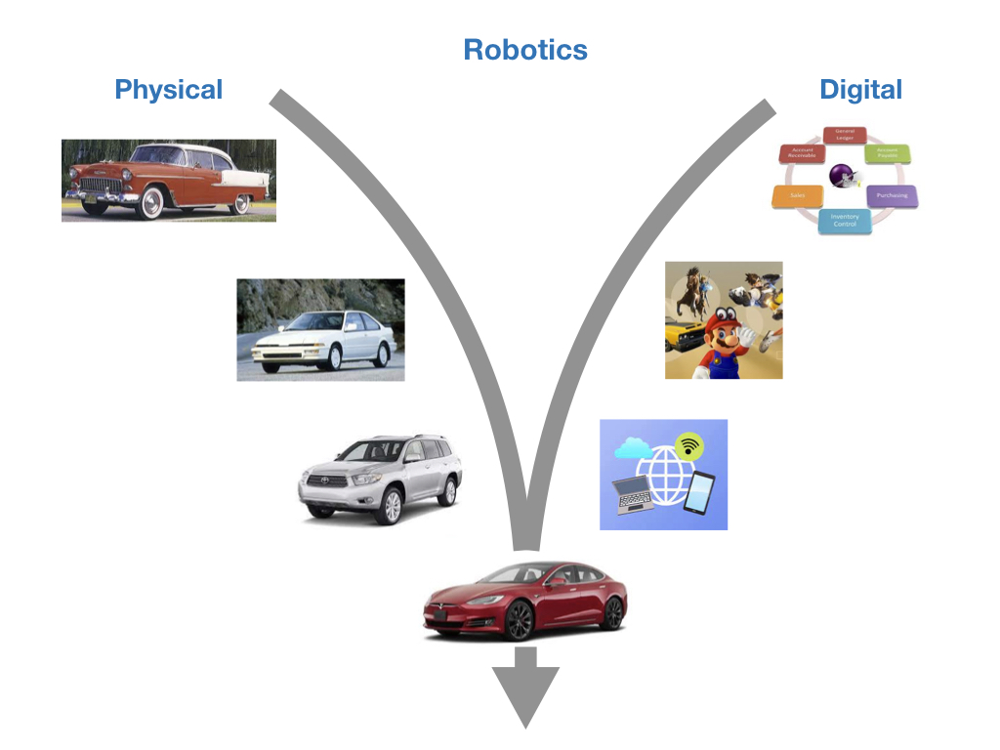
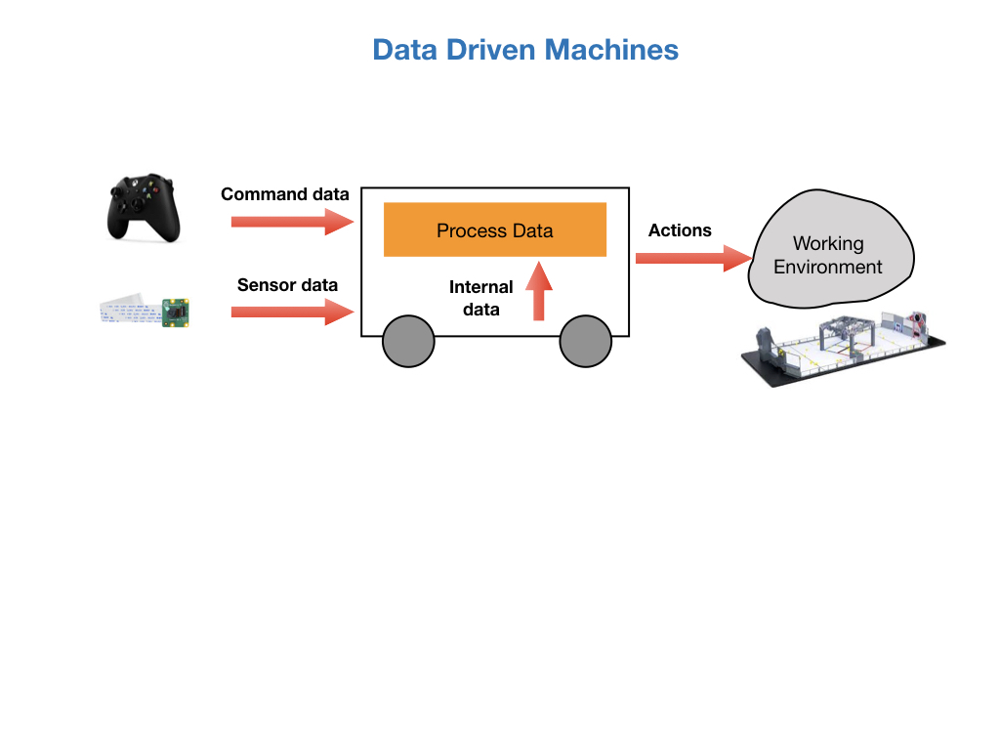
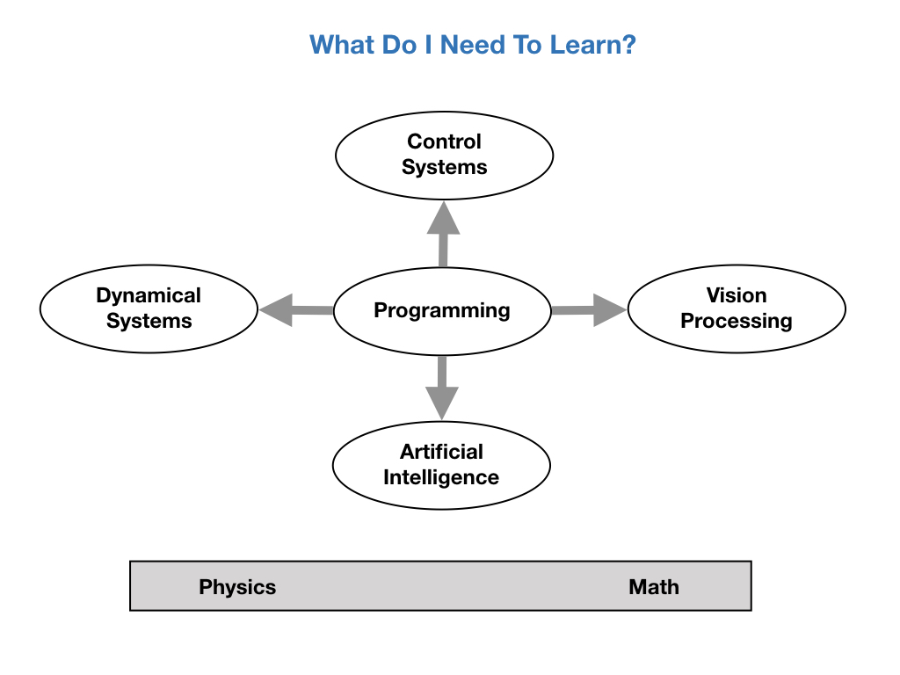
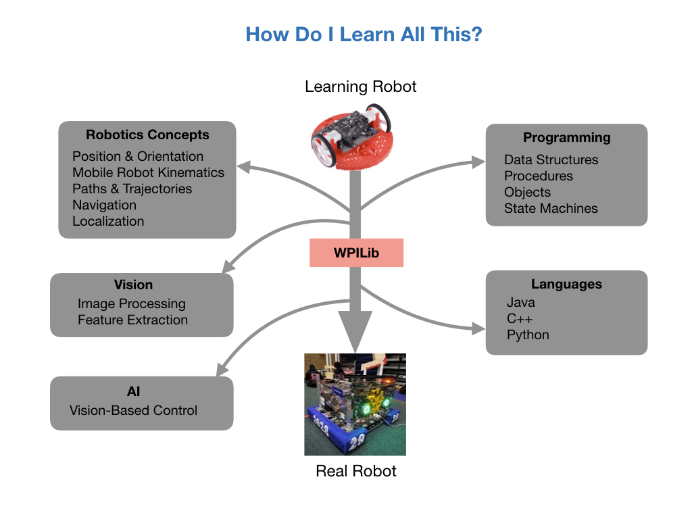

# Why Join the Programming Team?

The Mechanical and Electrical teams will deliver a very impressive robot and it's the Programming teams job to get it to do something.

The programs that we write will help the robot's driver move around the competition field using his/her game controller. 

During the first 15 seconds of the contest, called the Autonomous Period, the software will take complete control of the robot.  During that period we'll be relying on the skill of the programming team to score points and get us ahead in game.  

Without the programming team the robot will sit there and do nothing during the first 15 seconds leaving us behind in points from other competing teams.

No matter what you decide to do as a career you'll always be ahead of the game if you know how to program.  Especially if you're going into any of the engineering or technical fields.  For which it's going to be pretty much a requirement. 

So here's what you'll learn as part of the programming team.

## Programming Languages

Since this is the programming team you will of course learn programming languages:

- The main language will be **Java** which used to control the competition robot.  This is the language in which most of the training will take place. After learning your first language it's not too difficult to learn others since they all use the same basic concepts.

- You'll also learn **C++** since this is used to program microcontrollers such as Arduinos. C++ is the most widely used language in the robotics industry because it's very fast and is used for low level hardware control, such as drivers.  We also have a microcontroller on the **Romi Robot** that we'll be using for training.

- Lastly, you'll learn some **Python** which has a large collection of libraries for vision processing and machine learning (AI).

We'll need something to train on so this year we'll be using the **Romi Robot**. Most of the code that you write for the Romi can be used on the real competition robot with a few modifications.

## Control Systems Engineering
Robotics brings together engineering and computer science. The key aim of robotics is to produce programmable machines that can sense the world around it and perform tasks.

In order to get the robot to do those things it's necessary to understand Control Systems. Control systems help to control the movements and functions of the robot.

Control systems are computer algorithms that take input from a user or robotic sensors and perform the required actions based on that input. 

We'll learn several very useful standard algorithms and also create some of our own.  Especially when we get into build season.

## Vision Processing and Control
If you're going to compete at the higher levels of the FIRST Robotics Competition you'll need the robot to process and interpret images coming off of cameras.  

Vision processing is becoming a larger and larger part of robotics primarily because of the advances in machine learning and faster and cheaper graphics processors.  In fact, it's the technology that is used for Self Driving Cars.  At least for Teslas.

We'll be using Raspberry Pi cameras and the Python programming language to do all of this.

